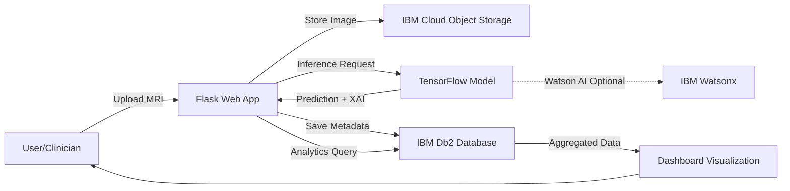

# 🫀 AI-Powered Heart MRI Classification for Clinical Decision Support

### 💎 **Enterprise AI for Global Cardiac Care: Explainable, Fast, Trusted**

    

---

## 🎥 Watch the Demo

[](https://youtu.be/JMZrROrt5qQ?si=V046ShjApX__89Iv)

*Click above to see the system in action: MRI upload → instant classification → explainable AI heatmaps → clinical dashboard*

---

## 🌟 Why It Matters

**Transforming cardiac diagnostics with cutting-edge AI that delivers real-world clinical impact:**

- ⚡ **Faster Diagnosis** — Reduces MRI interpretation time from hours to seconds, enabling rapid clinical response
- 🔬 **Explainable AI for Clinical Trust** — XAI heatmaps (Grad-CAM, Integrated Gradients) provide visual evidence for every prediction, building physician confidence and enabling validation
- 🎯 **Automated Priority Triage** — Intelligent classification helps prioritize critical cases, optimizing workflow efficiency in busy cardiac centers
- ☁️ **Cloud-Ready & Scalable** — Built on IBM Cloud with enterprise-grade Object Storage (COS), Db2 database, and Watson AI services for global deployment
- 🏅 **IBM Recognition** — Selected as finalist, demonstrating technical excellence, innovation, and real-world applicability in healthcare AI

---

## 💡 WOW Factors & Innovations

**What makes this project stand out from the crowd:**

### 🔥 **XAI Overlays: See What the AI Sees**

- **Grad-CAM & Integrated Gradients** generate pixel-level heatmaps showing exactly which anatomical regions influenced each prediction
- Transforms "black box" models into **transparent, trustworthy clinical tools**
- Enables radiologists to validate AI reasoning against their own expert analysis
- Color-coded overlays highlight regions of interest (e.g., myocardial walls, chambers, valve areas)

### 🎨 **Advanced Multi-Class Classification**

- **4-class pathology detection:**
  - ✅ Normal
  - 🔴 Myocardial Infarction
  - 🔵 Dilated Cardiomyopathy (DCM)
  - 🟣 Hypertrophic Cardiomyopathy (HCM)
- State-of-the-art CNN architecture (MobileNetV2 + custom layers) optimized for cardiac MRI
- Real-time inference: predictions in <2 seconds
- High accuracy with robust validation on diverse datasets

### ☁️ **Production-Ready IBM Cloud Integration**

- **IBM Object Storage (COS):** Secure, scalable storage for DICOM images and medical records
- **IBM Db2:** Relational database for case metadata, patient demographics, and audit trails
- **Watson AI / Watsonx:** Real-time AI inference with enterprise SLAs
- **Dashboard Analytics:** Aggregated stats, confidence distribution, cohort-level insights for quality improvement

### 📊 **Interactive Clinical Dashboard**

- Live case tracking with filterable views (by severity, date, physician)
- Model confidence metrics and prediction trends over time
- Export capabilities for clinical reports and research

---

## 🏥 Clinical Use Case

In a typical cardiology workflow, radiologists often face backlogs of MRI scans requiring expert interpretation—leading to delayed diagnoses and treatment. **This AI system integrates seamlessly into clinical pipelines**, automatically analyzing uploaded cardiac MRI images and providing instant multi-class predictions alongside explainable heatmaps. Physicians can quickly review AI-assisted insights, prioritize urgent cases (e.g., acute myocardial infarction), and validate findings with transparent visual evidence. By reducing interpretation time and enhancing diagnostic confidence, the system supports faster clinical decision-making, better patient outcomes, and more efficient use of specialist time—particularly valuable in resource-constrained or high-volume settings.

---

## 📸 Sample Results & Screenshots


---

## 🏗️ Architecture

**System Design & Data Flow:**


*High-level architecture showing user interface, Flask backend, TensorFlow model inference, IBM Cloud services (COS, Db2, Watson AI), and dashboard analytics pipeline*

### 🔧 Technical Flow



**Key Components:**
- **Frontend:** HTML/CSS/JS with responsive design for desktop and tablet use
- **Backend:** Python Flask REST API handling uploads, inference orchestration, database queries
- **AI Engine:** TensorFlow 2.x with custom-trained CNN + XAI modules (Grad-CAM, IG)
- **Storage:** IBM COS for DICOM/image files; Db2 for structured case data
- **Monitoring:** Real-time dashboard with Plotly/D3.js visualizations

---

## 🚀 Features at a Glance

✅ **Multi-class cardiac pathology classification** (4 conditions)  
✅ **Explainable AI (XAI)** with Grad-CAM and Integrated Gradients heatmaps  
✅ **DICOM & standard image format support**  
✅ **IBM Cloud integration** (COS, Db2, Watson AI)  
✅ **Real-time inference** (<2 sec per scan)  
✅ **Clinical dashboard** with analytics, trends, and case management  
✅ **Scalable, production-ready architecture**  
✅ **Secure, audit-compliant** data handling  

---

## 🛠️ Tech Stack

| Category | Technologies |
|----------|-------------|
| **AI/ML** | TensorFlow 2.x, Keras, NumPy, OpenCV, scikit-learn |
| **Backend** | Python 3.9+, Flask 2.x, Gunicorn |
| **Frontend** | HTML5, CSS3, JavaScript, Bootstrap 5, Plotly.js |
| **Cloud Services** | IBM Cloud Object Storage (COS), IBM Db2, IBM Watson AI/Watsonx |
| **XAI** | tf-explain (Grad-CAM), Integrated Gradients, LIME |
| **Data Formats** | DICOM, PNG, JPEG, NIfTI |
| **DevOps** | Docker, Git, GitHub Actions (CI/CD) |

---

## 📦 Installation & Setup

### Prerequisites

- Python 3.9 or higher
- IBM Cloud account (free tier available)
- Git

### 1️⃣ Clone the Repository

```bash
git clone https://github.com/Darkwebnew/AI-Powered-Heart-MRI-Classification-for-Clinical-Decision-Support.git
cd AI-Powered-Heart-MRI-Classification-for-Clinical-Decision-Support
```

### 2️⃣ Create Virtual Environment

```bash
python -m venv venv
source venv/bin/activate  # On Windows: venv\Scripts\activate
```

### 3️⃣ Install Dependencies

```bash
pip install --upgrade pip
pip install -r requirements.txt
```

### 4️⃣ Configure IBM Cloud Credentials

Create a `.env` file in the project root:

```env
IBM_COS_ENDPOINT=https://s3.us-south.cloud-object-storage.appdomain.cloud
IBM_COS_API_KEY_ID=your_api_key_here
IBM_COS_INSTANCE_CRN=your_instance_crn_here
IBM_COS_BUCKET_NAME=your_bucket_name

IBM_DB2_HOSTNAME=your_db2_hostname
IBM_DB2_PORT=50000
IBM_DB2_DATABASE=your_database_name
IBM_DB2_USERNAME=your_username
IBM_DB2_PASSWORD=your_password
```

### 5️⃣ Initialize Database

```bash
python init_db.py
```

### 6️⃣ Run the Application

```bash
python app.py
# or
flask run --host 0.0.0.0 --port 8080
```

Access the app at **http://localhost:8080**

---

## 👩‍⚕️ Usage

1. **Upload MRI/DICOM:** Navigate to the upload page and select a cardiac MRI image
2. **View Prediction:** Instantly see the classification result with confidence scores and XAI heatmap overlay
3. **Save Case:** Store the case with metadata (patient ID, date, notes) to IBM Db2; image archived to COS
4. **Monitor Dashboard:** Access cohort statistics, model confidence distribution, and case trends
5. **Search & Export:** Filter cases by date, diagnosis, or confidence; export reports for clinical review

---

## 🧭 Repository Structure

```
.
├── app.py                      # Main Flask application
├── init_db.py                  # Database initialization script
├── requirements.txt            # Python dependencies
├── models/
│   ├── cardiac_model.h5        # Trained TensorFlow model
│   └── model_config.json       # Model architecture config
├── notebooks/
│   ├── training.ipynb          # Model training experiments
│   └── evaluation.ipynb        # Performance evaluation
├── static/
│   ├── css/                    # Stylesheets
│   ├── js/                     # Frontend JavaScript
│   └── uploads/                # Temporary upload directory
├── templates/
│   ├── index.html              # Upload interface
│   ├── result.html             # Prediction display
│   └── dashboard.html          # Analytics dashboard
├── docs/
│   └── images/
│       ├── banner.png
│       ├── architecture.png
│       ├── heatmap.png
│       ├── mri_upload.png
│       ├── prediction_output.png
│       ├── dashboard.png
│       └── case_list.png
├── utils/
│   ├── xai.py                  # Explainable AI functions
│   ├── ibm_cloud.py            # IBM Cloud service integrations
│   └── preprocessing.py        # Image preprocessing utilities
└── README.md
```

---

## 👩‍💻 Authors & Contributors

- **SHIVRAJ R** — [GitHub profile](https://github.com/ShivrajRajasekaran/)
- **SRIRAM V** — [GitHub profile](https://github.com/darkwebnew/)
- **M MADHURI G** — [GitHub profile](https://github.com/Munimadhuriganji)
- **G DARSHANI** — [GitHub profile](https://github.com/Gedipudidarshani)

*We welcome contributions! Feel free to open issues or submit pull requests.*

---

## 🙏 Acknowledgments

- **IBM Cloud** and the IBM Academic/Startup programs for credits, tooling, and technical guidance
- **Open-source community:** TensorFlow, Flask, Plotly, and medical imaging libraries
- **Medical datasets:** Thanks to public cardiac MRI repositories that enabled model training
- **Healthcare mentors** who provided clinical validation and feedback

---

## 📜 License

This project is intended for **research and educational use**. For clinical deployment, ensure regulatory compliance (FDA, CE marking, HIPAA) and thorough validation with institutional review board (IRB) approval.

---

<div align="center">

**Made with ❤️ for advancing global cardiac care through explainable AI**

⭐ **Star this repo if you find it useful!** ⭐

[Report Bug](https://github.com/Darkwebnew/AI-Powered-Heart-MRI-Classification-for-Clinical-Decision-Support/issues) · [Request Feature](https://github.com/Darkwebnew/AI-Powered-Heart-MRI-Classification-for-Clinical-Decision-Support/issues) · [Documentation](https://github.com/Darkwebnew/AI-Powered-Heart-MRI-Classification-for-Clinical-Decision-Support/wiki)

</div>
