<div align="center">


[](https://git.io/typing-svg)

<br/>

[](https://www.python.org/)
[](https://flask.palletsprojects.com/)
[](https://www.tensorflow.org/)
[](https://cloud.ibm.com/)
[](https://www.ibm.com/watsonx)

<br/>

[](https://www.linkedin.com/posts/sriram-v-38305a220_ibmz-mainframe-ibmzdatathon2025-activity-7390066478483685377-KORq)
[]()
[](LICENSE)
[]()

<br/>

> **🫀 Enterprise AI for cardiac care — MobileNetV2 classifies cardiac MRI into 4 pathology classes, Grad-CAM & Integrated Gradients generate explainable heatmaps, and IBM Cloud provides audit-compliant storage — all in under 2 seconds.**

<br/>

> **⚕️ Medical Disclaimer:** This system is an AI-assisted screening tool designed to **support** qualified medical professionals. All AI predictions require review by a licensed cardiologist before any clinical decision is made.

<br/>

[🎥 Demo](#-watch-the-demo) &nbsp;•&nbsp; [🚀 Quick Start](#-installation--setup) &nbsp;•&nbsp; [🏗️ Architecture](#%EF%B8%8F-architecture) &nbsp;•&nbsp; [📸 Screenshots](#-sample-results--screenshots) &nbsp;•&nbsp; [🏆 Achievement](#-ibm-z-datathon-2025--achievement) &nbsp;•&nbsp; [👥 Team](#-authors--contributors) &nbsp;•&nbsp; [☕ Support](#-support-the-project)

</div>

---

<div align="center">

## 🎥 Watch the Demo

[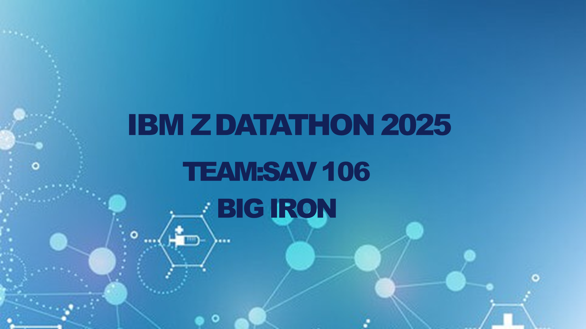][(https://youtu.be/JMZrROrt5qQ)](https://youtu.be/JMZrROrt5qQ?si=hu2FR6HA7b2yUXdq)

*Click above — MRI upload → instant classification → explainable AI heatmaps → clinical dashboard*

</div>

---

<div align="center">

## 🏆 Why Heart MRI AI?

</div>

```
Traditional Radiology  →  Manual review, hours of wait, no visual evidence, no prioritization
Heart MRI AI           →  Sub-2s CNN inference, Grad-CAM heatmaps, IBM Cloud audit trail
```

<table align="center">
<tr>
<td align="center" width="200">

<br/><b>4-Class Diagnosis</b>
<br/><sub>Normal · Myocardial Infarction · DCM · HCM</sub>
</td>
<td align="center" width="200">

<br/><b>Explainable AI</b>
<br/><sub>Grad-CAM + Integrated Gradients heatmaps for physician trust</sub>
</td>
<td align="center" width="200">

<br/><b>IBM Cloud Ready</b>
<br/><sub>COS + Db2 + Watsonx — enterprise-grade, audit-compliant</sub>
</td>
<td align="center" width="200">

<br/><b>IBM Z Datathon 🥈</b>
<br/><sub>2nd Place · $500 · IBM Mentorship · LICC $10K+</sub>
</td>
</tr>
</table>

---

## 🏆 IBM Z Datathon 2025 — Achievement

<div align="center">

| | Achievement |
|--|------------|
| 🥈 | **2nd Place** — IBM Z Datathon 2025, Chennai In-Person Track |
| 👥 | **Team BIG IRON** (SAV106) — Sriram V, Shivraj R, Gedipudi Darshani, Ganji Muni Madhuri |
| 💵 | **$500 Prize** + **3-Month IBM Mentorship** |
| 🎟️ | **LICC Access** worth $10,000+ |
| 🏢 | **IBM Systems Bangalore Labs Visit** |
| 🌍 | Organized by IBM Z & Shooting Stars Foundation |

</div>

> 📣 **[View our LinkedIn announcement →](https://www.linkedin.com/posts/sriram-v-38305a220_ibmz-mainframe-ibmzdatathon2025-activity-7390066478483685377-KORq)**

---

## 🌟 Project Overview

**Heart MRI AI** is an intelligent, explainable clinical decision support system developed as a Final Year Project at **Saveetha Engineering College** — and recognized as a **2nd Place winner at IBM Z Datathon 2025**. It unifies deep learning with IBM Cloud services to deliver automated multi-class cardiac pathology classification, XAI heatmap overlays, and a comprehensive clinical dashboard.

> 🎓 **Academic Supervisor:** Ms. V. Swedha, Saveetha Engineering College
> 📅 **Academic Year:** 2024–2025
> 🏅 **Recognition:** IBM Z Datathon 2025 — 2nd Place, Team BIG IRON
> 🏛️ **Institution:** Saveetha Engineering College, Chennai

### 🎯 Problem Statement

Radiologists in busy cardiac centers face mounting backlogs of MRI scans — leading to delayed diagnoses and treatment. Traditional systems offer no automation, no prioritization, and no visual explanation for their outputs. **Heart MRI AI** solves this by classifying cardiac MRI into four pathology classes with a custom-trained CNN, generating visual Grad-CAM heatmaps for every prediction, and archiving case history to IBM Cloud for longitudinal, audit-compliant tracking.

---

## ✨ Feature Highlights

<details>
<summary><b>🧠 CNN Multi-Class Cardiac Classification</b></summary>

- **MobileNetV2 + Custom Classification Head** — optimized for cardiac MRI
- **4 pathology classes** — Normal, Myocardial Infarction, DCM, HCM
- **< 2 second inference** per scan
- **Confidence scores** for every prediction
- Full training pipeline via `train_and_test.py`
- Model exported as `.keras` (TensorFlow 2.x)

</details>

<details>
<summary><b>🔥 Explainable AI — Grad-CAM & Integrated Gradients</b></summary>

- **Grad-CAM** — gradient-weighted class activation maps highlighting critical regions
- **Integrated Gradients** — attribution maps showing pixel-level contribution to prediction
- Color-coded overlays: myocardial walls, chambers, valve areas
- Transforms "black box" deep learning into **transparent clinical tools**
- Physicians can validate AI reasoning against their own expert analysis
- All generated by `overlay_mri_abnormalities.py`

</details>

<details>
<summary><b>☁️ IBM Cloud Integration</b></summary>

- **IBM Cloud Object Storage (COS)** — secure, scalable archival for MRI images and DICOM files via `cos_uploader.py`
- **IBM Db2** — relational database for case metadata, demographics, history, and full audit trails via `db2_connector.py`
- **IBM Watson AI / Watsonx** — optional enterprise-grade inference backend
- **HIPAA-aligned** data handling and IAM access control

</details>

<details>
<summary><b>📊 Clinical Dashboard & Analytics</b></summary>

- **Plotly.js interactive charts** — confidence distribution, case trends, cohort analytics
- **Case history viewer** — full longitudinal patient tracking
- **Priority triage** — critical cases (e.g., acute MI) surfaced automatically
- **Report export** — clinical-grade PDF generation

</details>

<details>
<summary><b>🔒 Security & Compliance</b></summary>

- JWT + Flask session management for secure clinician login
- IBM IAM policies restrict COS and Db2 access
- Encrypted credential management via `.env`
- Audit-compliant storage and retrieval
- HIPAA/GDPR-aligned architecture

</details>

---

## 🏗️ Architecture

<div align="center">

![Heart MRI AI Architecture]


*End-to-end pipeline: MRI upload → CNN → XAI heatmap → IBM COS + Db2 → clinical dashboard*

> **Note:** See `heartmri-architecture.html` for the full interactive architecture diagram.

</div>

### 🧩 System Components

| Component | File | Technology | Purpose |
|-----------|------|-----------|---------|
| **Web App** | `app.py` | Python, Flask | Upload interface, routing, orchestration |
| **ML Engine** | `training_outputs/heart_mri_model.keras` | TensorFlow 2.x, Keras | CNN pathology classification |
| **XAI Module** | `overlay_mri_abnormalities.py` | Grad-CAM, Integrated Gradients | Explainable heatmap generation |
| **COS Uploader** | `config/cos_uploader.py` | IBM Cloud SDK | Secure image archival |
| **Db2 Connector** | `config/db2_connector.py` | IBM Db2 | Case metadata, audit trails |
| **Dashboard** | `templates/graphs.html` | HTML5 / Plotly.js | Analytics & case management |
| **Auth** | `templates/login.html` | Flask Sessions | Secure clinician login |
| **Training Pipeline** | `train_and_test.py` | scikit-learn, Keras | Model training, evaluation, export |

### 🔄 Request Processing Flow

```
Clinician Upload (DICOM / PNG / JPEG)
         │
         ▼
Flask Backend (app.py)  ←── JWT Auth + Sessions
         │
         ▼
TensorFlow CNN Engine (MobileNetV2 + Custom Head)
    heart_mri_model.keras
         │
         ▼
4-Class Output: Normal · MI · DCM · HCM + Confidence Score
         │
         ▼
XAI Overlay (Grad-CAM + Integrated Gradients)
    overlay_mri_abnormalities.py
         │
         ├──► IBM Cloud Object Storage (MRI image archival)
         │
         ├──► IBM Db2 (case metadata + audit trail)
         │
         ▼
Clinical Dashboard (graphs.html / Plotly.js)
    + Report Export (report.html)
```

---

## 📸 Sample Results & Screenshots

<div align="center">

### 🎛️ Clinical Dashboard

| Normal Prediction | Sick Prediction |
|------------------|-----------------|
| 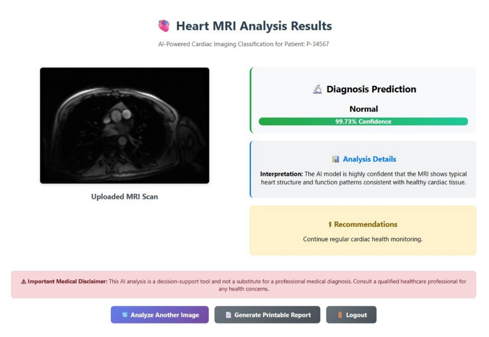 | 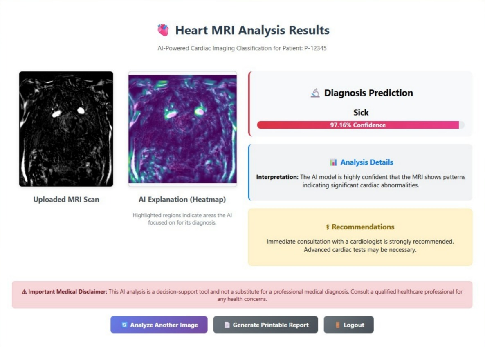 |

### 🔍 Core Features

| Upload Interface | Image Segmentation |
|-----------------|-------------------|
| 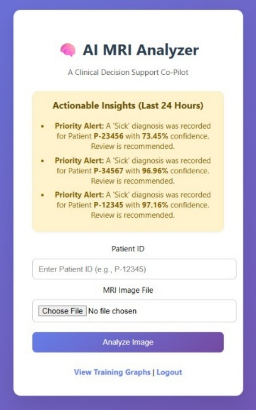 | 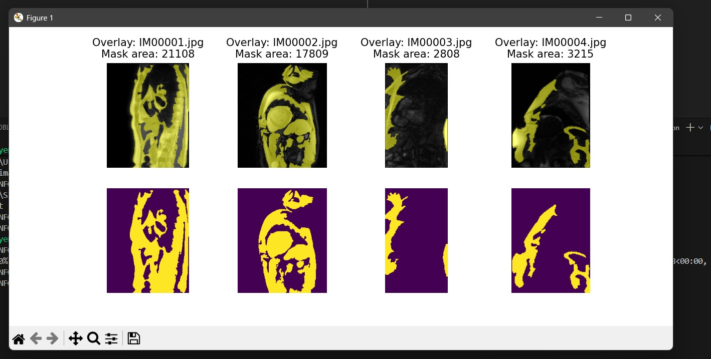 |

| Medical AI Assistance | XAI Heatmap Output |
|----------------------|--------------------|
| 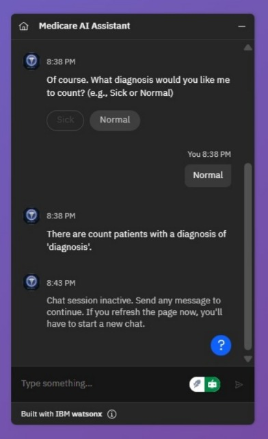 | 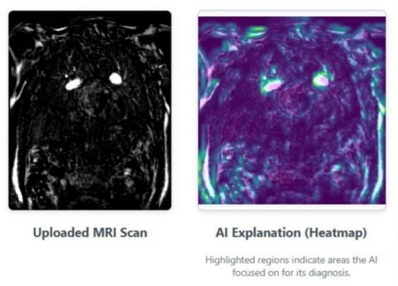 |

### ☁️ IBM Cloud Integration

| IBM Cloud Bucket | IBM Db2 — Results | IBM Db2 — History |
|-----------------|------------------|------------------|
| 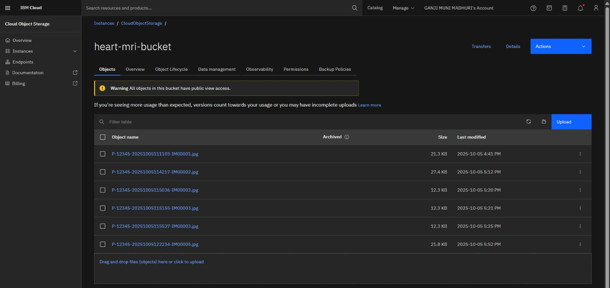 | 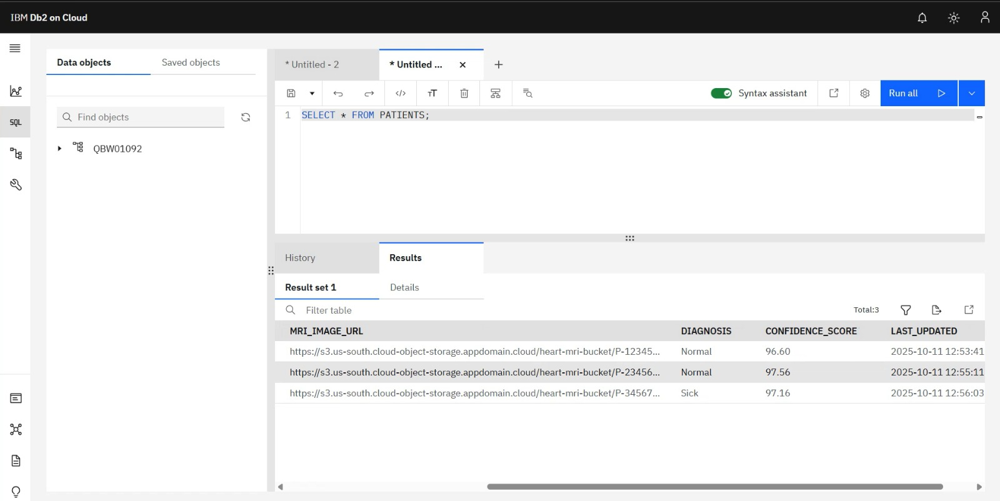 | 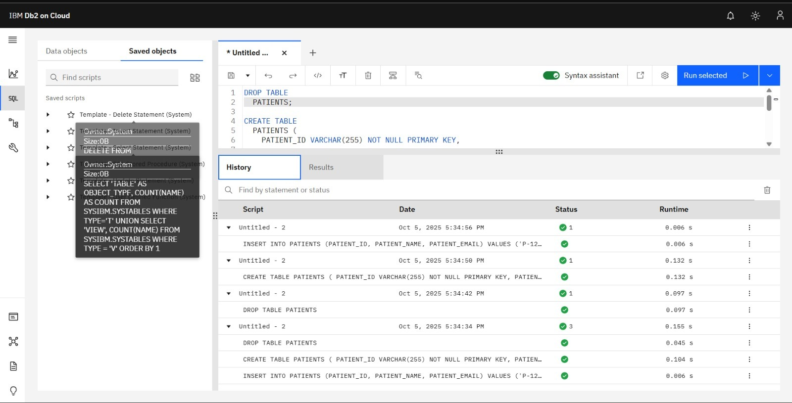 |

### 📊 Training & Evaluation Metrics

| Confusion Matrix | Loss & Accuracy | Precision / Recall / F1 |
|----------------|----------------|------------------------|
| 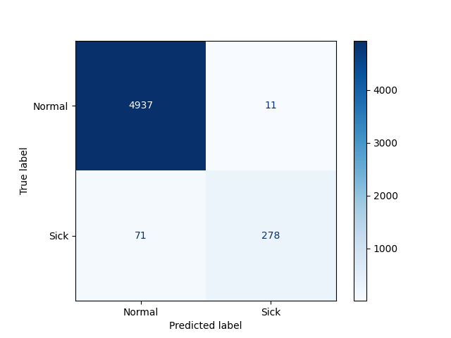 | 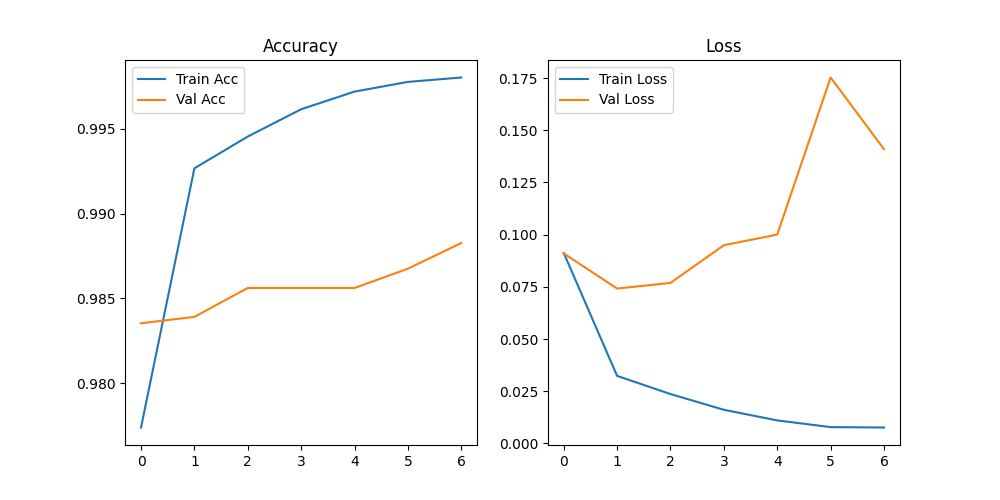 |  |

</div>

---

## 📂 Project Structure

```plaintext
AI-Powered-Heart-MRI-Classification/
│
├── 📁 config/
│   ├── __init__.py
│   ├── config.py                        # App configuration
│   ├── cos_uploader.py                  # IBM Cloud Object Storage uploader
│   └── db2_connector.py                 # IBM Db2 database connector
│
├── 📁 img/                               # Screenshots & diagrams
│   ├── Dahboard_Prediction_Normal.jpeg
│   ├── Dahboard_Prediction_Sick.jpeg
│   ├── Dashboard_Upload.jpeg
│   ├── IBM_Cloud_Bucket.jpeg
│   ├── IBM_Db2_Cloud_History.jpeg
│   ├── IBM_Db2_Cloud_Result.jpeg
│   ├── Image_Segmentation.jpeg
│   ├── Medical_AI_Assistance.jpeg
│   ├── Video.mp4                         # Demo video
│   ├── confusion_matrix.png
│   ├── loss_accuracy.png
│   └── precision_recall_f1.png
│
├── 📁 static/
│   ├── graphs/                           # Generated Plotly assets
│   ├── uploads/                          # Temporary upload directory
│   ├── login.jpg / upload.jpg            # Page backgrounds
│   └── main.css                          # Global stylesheet
│
├── 📁 templates/
│   ├── login.html                        # Clinician login page
│   ├── upload.html                       # MRI upload interface
│   ├── result.html                       # Prediction + XAI heatmap
│   ├── report.html                       # Clinical report export
│   └── graphs.html                       # Analytics dashboard
│
├── 📁 training_outputs/
│   ├── 📁 graphs/
│   │   ├── confusion_matrix.png
│   │   ├── loss_accuracy.png
│   │   └── precision_recall_f1.png
│   └── heart_mri_model.keras             # Trained TensorFlow model
│
├── 📄 app.py                             # Main Flask application
├── 📄 train_and_test.py                  # Model training & evaluation
├── 📄 overlay_mri_abnormalities.py       # XAI heatmap generation
├── 📄 openapi_spec.json                  # OpenAPI / Swagger spec
├── 📄 requirements.txt
└── 📄 README.md
```

---

## 🛠️ Tech Stack

| Category | Technologies |
|----------|-------------|
| **AI / ML** | TensorFlow 2.x · Keras · MobileNetV2 · NumPy · OpenCV · scikit-learn |
| **XAI** | Grad-CAM · Integrated Gradients (`overlay_mri_abnormalities.py`) |
| **Backend** | Python 3.9+ · Flask 2.x |
| **Frontend** | HTML5 · CSS3 · JavaScript · Bootstrap 5 · Plotly.js |
| **Cloud** | IBM Cloud Object Storage · IBM Db2 · IBM Watson AI / Watsonx |
| **Data Formats** | DICOM · PNG · JPEG · NIfTI |
| **DevOps** | Git · Docker-ready · GitHub Actions |

---

## 📦 Installation & Setup

### 📋 Prerequisites

```
✓ Python 3.9+          ✓ IBM Cloud account (free tier available)
✓ Git                   ✓ 4GB+ RAM recommended
```

### 1️⃣ Clone

```bash
git clone https://github.com/Darkwebnew/AI-Powered-Heart-MRI-Classification-for-Clinical-Decision-Support.git
cd AI-Powered-Heart-MRI-Classification-for-Clinical-Decision-Support
```

### 2️⃣ Virtual Environment

```bash
python -m venv venv
source venv/bin/activate        # Windows: venv\Scripts\activate
pip install --upgrade pip
pip install -r requirements.txt
```

### 3️⃣ Configure IBM Cloud Credentials

Create a `.env` file:

```env
# IBM Cloud Object Storage
IBM_COS_ENDPOINT=https://s3.us-south.cloud-object-storage.appdomain.cloud
IBM_COS_API_KEY_ID=your_api_key_here
IBM_COS_INSTANCE_CRN=your_instance_crn_here
IBM_COS_BUCKET_NAME=your_bucket_name

# IBM Db2
IBM_DB2_HOSTNAME=your_db2_hostname
IBM_DB2_PORT=50000
IBM_DB2_DATABASE=your_database_name
IBM_DB2_USERNAME=your_username
IBM_DB2_PASSWORD=your_password
```

### 4️⃣ Run

```bash
python app.py
```

Open **http://localhost:5000**

---

## 🚀 Quick Start

```
1️⃣  Login      →  http://localhost:5000/login
2️⃣  Upload MRI →  DICOM, PNG, or JPEG
3️⃣  Predict    →  Instant classification + confidence score + XAI heatmap
4️⃣  Dashboard  →  /graphs — cohort stats, confidence trends, case history
5️⃣  Report     →  Export clinical-grade report
```

### (Optional) Retrain the Model

```bash
python train_and_test.py
# Output: training_outputs/heart_mri_model.keras
# Graphs: training_outputs/graphs/
```

---

## 📖 API Reference

Full spec → `openapi_spec.json` (importable into Swagger UI / Postman)

| Method | Endpoint | Purpose | Auth |
|--------|----------|---------|------|
| `GET/POST` | `/login` | Clinician authentication | Public |
| `GET` | `/upload` | MRI upload interface | Session |
| `POST` | `/predict` | Run inference + XAI heatmap | Session |
| `GET` | `/result` | Display classification result | Session |
| `GET` | `/graphs` | Analytics dashboard | Session |
| `GET` | `/report` | Clinical report export | Session |
| `GET` | `/logout` | End session | Session |

---

## 📊 Model Performance

| Metric | Value |
|--------|-------|
| **Architecture** | MobileNetV2 + Custom Classification Head |
| **Classes** | Normal · Myocardial Infarction · DCM · HCM |
| **Inference Speed** | < 2 seconds per scan |
| **XAI Methods** | Grad-CAM + Integrated Gradients |
| **Output Format** | `.keras` (TensorFlow 2.x) |

*See `training_outputs/graphs/` for full confusion matrix, loss/accuracy curves, and precision/recall/F1 plots.*

---

## 🔒 Security Checklist

- [ ] Set strong credentials in `.env` — never commit secrets
- [ ] Enable HTTPS for all web traffic in production
- [ ] Restrict IBM Db2 and COS via IAM policies
- [ ] HIPAA / GDPR compliance for patient data
- [ ] IRB approval before clinical deployment
- [ ] Validate model on your institution's dataset before clinical use

> ⚠️ For clinical deployment, ensure full regulatory compliance (FDA, CE marking, HIPAA) and thorough institutional validation.

---

## 👥 Authors & Contributors

<div align="center">

### 🏆 Team BIG IRON — IBM Z Datathon 2025 🥈

<table>
<tr>

<td align="center" width="220">
<a href="https://github.com/ShivrajRajasekaran">

</a>
<br/><br/>
<b>Shivraj R</b>
<br/>
<sub>🚀 Project Lead & AI/ML Developer</sub>
<br/>
<sub>CNN Architecture · XAI · Model Training</sub>
<br/><br/>
<a href="https://github.com/ShivrajRajasekaran">

</a>
</td>

<td align="center" width="220">
<a href="https://github.com/darkwebnew">

</a>
<br/><br/>
<b>Sriram V</b>
<br/>
<sub>⚙️ Backend & IBM Cloud Integration</sub>
<br/>
<sub>Flask API · COS · Db2 · Deployment</sub>
<br/><br/>
<a href="https://github.com/darkwebnew">

</a>
</td>

<td align="center" width="220">
<a href="https://github.com/Munimadhuriganji">

</a>
<br/><br/>
<b>Madhuri G M</b>
<br/>
<sub>🎨 Frontend & Research</sub>
<br/>
<sub>Dashboard UI · Clinical Docs</sub>
<br/><br/>
<a href="https://github.com/Munimadhuriganji">

</a>
</td>

<td align="center" width="220">
<a href="https://github.com/Gedipudidarshani">

</a>
<br/><br/>
<b>Darshani G</b>
<br/>
<sub>🔬 Research & Validation</sub>
<br/>
<sub>Dataset Curation · Clinical Feedback</sub>
<br/><br/>
<a href="https://github.com/Gedipudidarshani">

</a>
</td>

</tr>
</table>

<br/>

### 🎓 Academic Guidance

| Role | Name | Institution |
|------|------|-------------|
| Event Coordinator | **Dr. Karthika RN** | IBM Z Datathon 2025 |

</div>

---

## 🤝 Contributing

> ⚠️ **Important:** This project is under a restrictive proprietary license. Contributions are welcome strictly for **educational improvement purposes only.** By submitting a pull request, you agree your contribution becomes part of this project under the same license. No contributor may independently use, redistribute, or commercialize any part of this code.

### How to Contribute

1. **Open an Issue** — discuss your idea before coding
2. **Fork** the repository
3. **Create a branch** — `git checkout -b feature/YourFeature`
4. **Commit** — `git commit -m 'feat: Add YourFeature'`
5. **Open a Pull Request** with a detailed description

### Contribution Areas

| Area | Difficulty | Skills Needed |
|------|-----------|--------------|
| 🧠 New CNN Architectures | Advanced | Python, TensorFlow, Keras |
| 🔥 Additional XAI Methods | Advanced | Grad-CAM, SHAP, LIME |
| 🌐 New API Endpoints | Medium | Flask, REST |
| 🎨 Dashboard UI | Medium | HTML, CSS, Plotly.js |
| ☁️ Cloud Integrations | Medium | IBM Cloud SDK |
| 📚 Documentation | Beginner | Markdown |

---

## ☕ Support the Project

<div align="center">

**If Heart MRI AI helped your research or clinical project — consider supporting continued development!**

<br/>

<a href="https://www.buymeacoffee.com/sriramnvks" target="_blank">

</a>

<br/><br/>

*Your support helps build better AI healthcare tools and publish more research.*

<br/>

[](https://github.com/sponsors/darkwebnew)
[](https://paypal.me/sriramnvks)

</div>

---

## 📄 License

<div align="center">

```
╔══════════════════════════════════════════════════════════════════╗
║              PROPRIETARY SOFTWARE LICENSE                        ║
║   Copyright (c) 2024–2025  Shivraj R, Sriram V & Heart MRI Team ║
║                   All Rights Reserved                            ║
╚══════════════════════════════════════════════════════════════════╝
```

</div>

**This software, trained ML models, XAI modules, IBM Cloud integration code, clinical templates, documentation, and all associated assets are the exclusive intellectual property of the authors and are protected under applicable copyright law and the Indian Copyright Act, 1957.**

### ❌ You MAY NOT:

- Copy, reproduce, or redistribute this code in whole or in part
- Use this project in commercial medical products or services
- Deploy in any clinical environment without written authorization
- Use trained model weights or XAI code without explicit permission
- Present this work as your own in academic or professional contexts

### ✅ You MAY:

- View and study the source code for **personal educational purposes only**
- Fork on GitHub **solely to submit pull requests**
- Reference this project in academic citations with proper attribution

### ⚖️ Legal Notice

Any unauthorized use, reproduction, or clinical deployment is strictly prohibited. The authors reserve all rights.

> Licensing inquiries: [@darkwebnew](https://github.com/darkwebnew) via GitHub Issues

---

## 🙏 Acknowledgments

<div align="center">

| Contribution | Name / Organization |
|-------------|---------------------|
| Cloud Infrastructure | **IBM Cloud** — COS, Db2, Watson AI / Watsonx |
| Deep Learning | **TensorFlow / Keras** — MobileNetV2 framework |
| Web Framework | **Flask** — Python REST API |
| Visualizations | **Plotly.js** — Interactive dashboard |
| Competition Platform | **IBM Z & Shooting Stars Foundation** — Datathon 2025 |
| Medical Guidance | **Ms. V. Swedha** & **Dr. Karthika RN** |
| Institution | **Saveetha Engineering College**, Chennai |
| Research | **OWASP, Medical Imaging Community** — public cardiac MRI datasets |

</div>

---

<div align="center">


**⭐ Star this repository if Heart MRI AI helped your project!**

[](https://github.com/Darkwebnew/AI-Powered-Heart-MRI-Classification-for-Clinical-Decision-Support/stargazers)
[](https://github.com/Darkwebnew/AI-Powered-Heart-MRI-Classification-for-Clinical-Decision-Support/network/members)

<br/>

*Made with ❤️ for advancing global cardiac care through explainable AI*
*IBM Z Datathon 2025 🥈 · Saveetha Engineering College · Chennai, India 🇮🇳*

[🐛 Report Bug](https://github.com/Darkwebnew/AI-Powered-Heart-MRI-Classification-for-Clinical-Decision-Support/issues) · [💡 Request Feature](https://github.com/Darkwebnew/AI-Powered-Heart-MRI-Classification-for-Clinical-Decision-Support/issues) · [📖 API Docs](openapi_spec.json) · [🎥 Demo](https://youtu.be/JMZrROrt5qQ)

</div>
